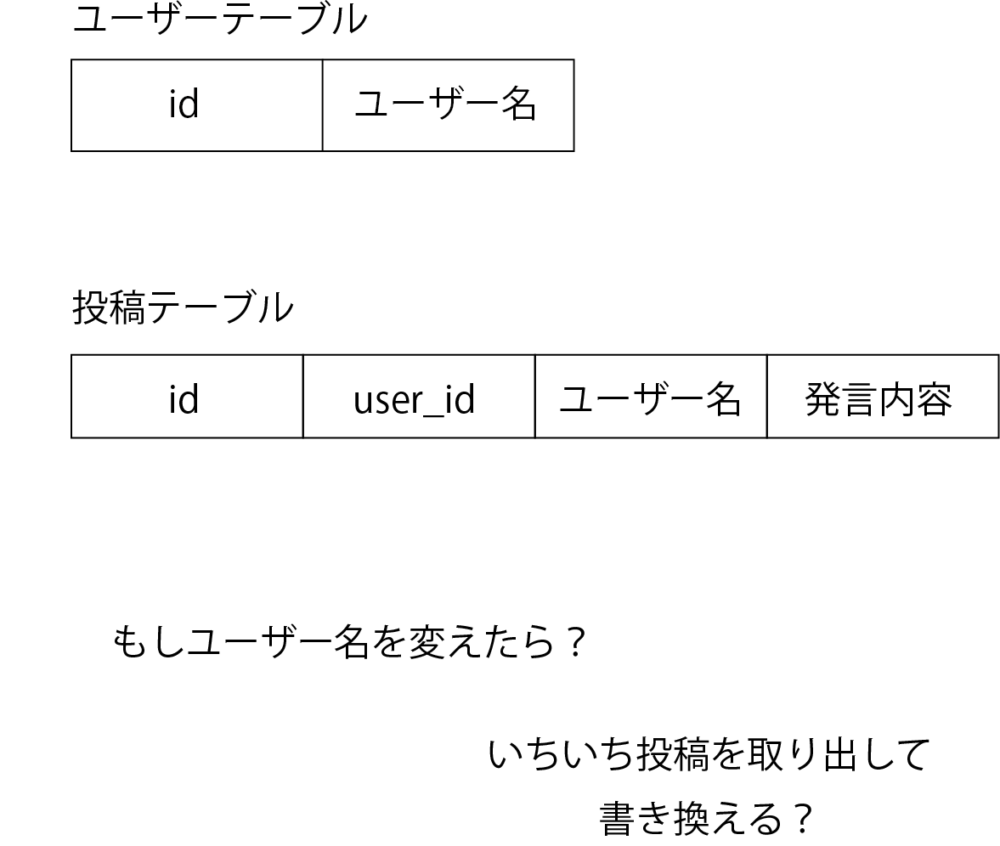

# データ保存の基礎。SQL

PHPの文法をおさらいしましたが、PHPをゴリゴリ書く前に、今回はLAMPのM、MySQLに焦点を当てて勉強していきます。MySQLを始めとするリレーショナルデータベースはSQLと呼ばれる言語で操作します。また近年開発されている様々なデータベースもSQLライクなインターフェースで走査することが多いため、しっかりとSQLに対する理解をもつことは重要です。

## データベースを叩いてみる

まずはデータベースにアクセスしましょう。以下のコマンドを叩いてコンテナに入ります。docker psでデータベースのコンテナ名を見つけてください。

```sh
docker exec -it sample_mysql_1 bash
```

そのあと、以下のようにコマンドを打つとMySQLに入ることができます。

```sh
mysql -u root -proot
```

入ったあと、以下のように表示されると思います。抜けるときはexitを打ってください。

```dbshell
mysql>
```

このあと以下のコマンドを打ってデータベースを確認しましょう。

```txt
mysql>SHOW DATABASES;

+--------------------+
| Database           |
+--------------------+
| information_schema |
| mysql              |
| performance_schema |
| sys                |
| test               |
+--------------------+
5 rows in set (0.01 sec)
```

環境構築で設定したtestがあるのでそのDBに入ってみましょう。

```txt
mysql>USE test;
Database changed
```

データベースはテーブルというものの集合で成り立ちます。テーブルを確認するには以下のコマンドを打ちます。

```txt
mysql>SHOW TABLES;
Empty set (0.00)
```

今回はとりあえず掲示板を作りたいので、投稿を管理するpostテーブルを作りましょう。

```txt
mysql>CREATE TABLE post(id INT AUTO_INCREMENT NOT NULL PRIMARY KEY, content TEXT);
Qurty OK, 0 rows affected (0.07 sec)
```

いきなり沢山情報が出てきたので一旦整理しましょう。今回は以下のコマンドを打ちました。

```sql
CREATE TABLE post(id INT AUTO_INCREMENT NOT NULL PRIMARY KEY, content TEXT);
```

リレーショナルデータベースはテーブルが基準です。テーブルはExcelのようなものをイメージしてください。

<div align="center">


Excelで表したテーブル
</div>

ここではINT(数値)型のidと、TEXT(文字列)のcontentの二つのカラムを持たせています。そしてidには AUTO_INCREMENTとNOT NULLが設定されています。AUTO_INCREMENTはidを設定せずにデータを挿入したときに、1から順番にidを割り振ってくれる機能です。そしてNOT NULLはidにNULLが入り込むことを許さないという設定です。

もういちどテーブルを確認してみましょう。

```txt
mysql>SHOW TABLES;
+----------------+
| Tables_in_test |
+----------------+
| post           |
+----------------+
1 row in set (0.00 sec)
```

postと呼ばれるテーブルが設定されました。このテーブルにデータを入れてみましょう

```txt
mysql>INSERT post (content) values ('テスト投稿');
Query OK, 1 row affected (0.03 sec)
```

データが挿入されたか確認してみます

```txt
mysql>SELECT * FROM post;
+----+-----------------+
| id | content         |
+----+-----------------+
|  1 | テスト投稿      |
+----+-----------------+
1 row in set (0.01 sec)
```

一応もう一つデータを入れておきましょう。

```txt
mysql>INSERT post (content) values ('テスト投稿2');
Query OK, 1 row affected (0.03 sec)
```

## PHPで同じことをしてみる

PHPで同じことをしてみましょう。

PHPにはPDOと呼ばれるクラスをつかってMySQLと接続します。昔のPHPにはMySQLやPostgreSQLなど個別に接続する関数があったのですが、今はPDOを使うことでおなじ関数でデータベースに接続できるようになっています。前章で書いたPHPのなかに以下のようなプログラムを書いてみてください。

```php
$dsn = 'mysql:dbname=test;host=mysql';
$user = 'test';
$password = 'test';

try{
    $dbh = new PDO($dsn, $user, $password);

    print('接続に成功しました。<br>');

}catch (PDOException $e){
    print('Error:'.$e->getMessage());
    die();
}
```

これで接続に成功できればmysqlに接続できています。こんどはデータを取り出してみましょう。先ほど書いたコードから以下のようにコードを追加してください。

```php
// SQLを組み立てます
$sql = 'SELECT * FROM post;';

// SQLからPDOStatementクラスのインスタンスを作成します
$prepare = $dbh->prepare($sql);

// 実行します
$prepare->execute();

// データを取り出します
$result = $prepare->fetchAll(PDO::FETCH_ASSOC);

// 結果を出力
var_dump($result);

```

これでデータを取り出すことができました。PDOStatementに関しては一旦説明を後回しにして、取り出したデータを掲示板っぽくレイアウトします。

HTMLのテーブルを使って整形します。各タグに関しては各自調べてみてください。

```php
<table>
<caption>掲示板</caption>
  <tr>
    <th>id</th>
    <th>発言</th>
  </tr>
  <?php
  foreach($result as $tmp){
      echo '<tr>';
      echo '<td>' . $tmp['id'] . '</td>';
      echo '<td>' . $tmp['content'] . '</td>';
      echo '</tr>';
  }
  ?>

</table>
```

大変見栄えが悪いですが、簡単な掲示板を作ることができました。

全てのWEBアプリケーションの基本はこの、SQLを組み立てる→SQLをデータベースに送信して結果を受け取る→結果を整形して出力するの流れで動かします。最近のフレームワークではORMを用いてデータを取ることが多くSQLを直接書くことが少なくなってきていますが、このORMはSQLを簡単に組み立てられるようにしただけで、SQLでデータベースを叩いていることは変わりません。パフォーマンス分析を行う上でもSQLが読み書きできるのはバックエンドエンジニアとして基礎的なスキルなのです。

## 外部キー制約の紹介

実装はしませんが外部キー制約について説明します。次の章から掲示板アプリを作っていくのですが、掲示板アプリならユーザー名が欲しくなってきます。ユーザーを保存するテーブルを作って、postテーブルには一々ユーザー名を文字列で保存するとしたらどうでしょう。もしユーザー名を変更するとき、そのユーザーの投稿を全て探して取り出して書き換えるのでしょうか？

<div align="center">



</div>

mysqlの場合はわざわざこのようなことはしません。postテーブルにユーザーテーブルを関連付ければいいのです。外部キー制約でユーザーテーブルのidを紐づけることで、postを取りに行くときに対応するユーザー名を取得してくれるので、ユーザーテーブルでユーザー名を書き換えると勝手に反映されます。これがmysqlがリレーショナルデータベースと言われる所以です。

